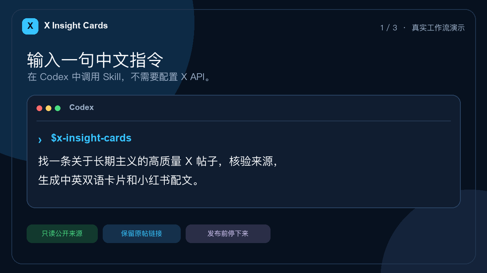

<p align="center">
  
</p>

<p align="center">
  <strong>A Codex Skill that finds high-quality X posts and turns them into content for Douyin and Xiaohongshu.</strong><br />
  <strong>自动搜集 X 优质帖子，并转化为抖音、小红书图文素材的 Codex Skill。</strong>
</p>

<p align="center">
  <a href="README.zh-CN.md">简体中文</a> ·
  <a href="#quick-start">Quick start</a> ·
  <a href="#workflow-demo">Watch demo</a> ·
  <a href="#creator-tested">Real-world results</a> ·
  <a href="https://github.com/ljunnan24-hash/x-insight-cards/releases/latest">Latest release</a>
</p>

<p align="center">
  
  <a href="https://github.com/ljunnan24-hash/x-insight-cards/releases/latest"></a>
  <a href="https://github.com/ljunnan24-hash/x-insight-cards/actions/workflows/ci.yml"></a>
  <a href="https://skills.sh/ljunnan24-hash/x-insight-cards/x-insight-cards"></a>
  
  
  
</p>

<a id="quick-start"></a>

## Install once. Run every day. · 安装一次，每天自动运行

**This is an installable Codex Skill—not a script kit you have to assemble.** Copy one command:

```bash
npx skills add ljunnan24-hash/x-insight-cards --skill x-insight-cards --agent codex --global --copy --yes
```

Add this prompt to a daily Codex automation—the demo uses 12:00 local time:

```text
Use $x-insight-cards to find today's best X posts and create up to five
review-ready image-and-caption packs for Douyin and Xiaohongshu. After QA,
write the private history to ~/Documents/x-insight-cards/history.jsonl,
mark the pack READY_FOR_REVIEW, and stop. Do not open WeChat or send anything;
private delivery is triggered later by the pinned review bot. Never publish.
```

Install once and schedule once; manual runs remain supported. No X API key, Cookie export, or prompt assembly is required. With an optional pinned iLink review bot, private phone delivery runs headlessly and does not depend on WeChat Desktop. Publishing remains manual.

<a id="workflow-demo"></a>

## Daily preparation, phone-triggered WeChat review · 每日准备，手机触发微信交付



The 13-second demo starts from a daily 12:00 Codex automation and follows one real, public [James Clear post](https://x.com/JamesClear/status/2045205241885323635) through visible source checks, scoring, deduplication, rendering, and private review delivery. In the current preferred route, the scheduled job stops at `READY_FOR_REVIEW`; the creator later sends `发今日素材` from their phone to a pinned iLink bot, which delivers the PNG and caption without opening WeChat Desktop. It never publishes to Douyin or Xiaohongshu.

Rebuild the demo locally with `make demo-gif`.

### Headless delivery through a pinned WeChat iLink bot

The preferred helper pins one recipient during configuration and never accepts a destination override while sending. Its long-poll listener accepts only the exact command `发今日素材` from that recipient, journals the request before advancing the sync cursor, checks for a completed review pack, and sends each image followed by its matching caption. Stable message IDs and checkpoints make retries resumable; a daily receipt prevents a second batch.

Credentials, context tokens, manifests, checkpoints, and receipts stay under the user's private `~/.weclaw` directory and are never committed. The listener can run under `launchd` on macOS or another process supervisor. It does not open, inspect, or control WeChat Desktop.

#### One-time macOS setup

Prerequisites: Node.js 18 or newer, the Skill installed by the command above, and a Mac that remains powered on, awake, online, and signed in to that macOS user account.

1. Install [WeClaw](https://github.com/fastclaw-ai/weclaw), then use it only for the QR login:

   ```bash
   curl -sSL https://raw.githubusercontent.com/fastclaw-ai/weclaw/main/install.sh | sh
   weclaw login
   ```

   Scan the QR code in WeChat and choose the dedicated robot conversation. Do **not** run `weclaw start` for the same robot: both processes would consume the same long-poll feed.

2. Locate the account credential created by login:

   ```bash
   find "$HOME/.weclaw/accounts" -maxdepth 1 -name '*.json' \
     ! -name '*.sync.json' -print
   ```

   If more than one file is listed, choose the dedicated robot account intentionally. Never paste the file contents anywhere.

3. Bind exactly one private review chat. Start the command below, then immediately send `绑定素材助手` from your phone to that robot:

   ```bash
   XIC_SKILL="${CODEX_HOME:-$HOME/.codex}/skills/x-insight-cards"
   node "$XIC_SKILL/scripts/wechat_ilink_delivery.mjs" setup \
     --credentials /absolute/path/to/account.json
   node "$XIC_SKILL/scripts/wechat_ilink_delivery.mjs" preflight
   ```

   Setup accepts only that exact phrase, requires one unique sender, stores a recipient fingerprint, and refuses to overwrite an existing binding.

4. Install and start the background listener:

   ```bash
   mkdir -p "$HOME/Documents/x-insight-cards"
   "$XIC_SKILL/scripts/wechat_ilink_listener_service.sh" install \
     --history "$HOME/Documents/x-insight-cards/history.jsonl"
   "$XIC_SKILL/scripts/wechat_ilink_listener_service.sh" status
   ```

   `launchd` starts it immediately, restarts it after a crash, and starts it again at macOS login. No WeChat Desktop window is involved. To remove only the listener while preserving private credentials and logs, run:

   ```bash
   "$XIC_SKILL/scripts/wechat_ilink_listener_service.sh" uninstall
   ```

After the daily Codex automation reaches `READY_FOR_REVIEW`, send `发今日素材` to the dedicated robot from the phone. The background listener replies “not ready” if the pack is incomplete and prevents a second delivery when that day's receipt already exists. On Linux or Windows, run `wechat_ilink_listener.mjs` with the system's process supervisor; the bundled automatic service installer is macOS-only.

<details>
<summary>Advanced manual configuration</summary>

```bash
# Pin the account files and recipient once
node skills/x-insight-cards/scripts/wechat_ilink_delivery.mjs configure \
  --credentials /absolute/path/to/account.json \
  --sync /absolute/path/to/account.sync.json \
  --recipient 'fixed-user-id@im.wechat'

# After the pinned user messages the bot, capture and verify fresh context
node skills/x-insight-cards/scripts/wechat_ilink_delivery.mjs capture-context
node skills/x-insight-cards/scripts/wechat_ilink_delivery.mjs preflight

# Run continuously; use a process supervisor for unattended operation
node skills/x-insight-cards/scripts/wechat_ilink_listener.mjs \
  --history /absolute/path/to/history.jsonl
```

</details>

The macOS integrated-main-window File Transfer Assistant helper remains available as a separately configured, fail-closed fallback. See [`private-delivery.md`](skills/x-insight-cards/references/private-delivery.md).

## See the output · 直接看结果


Each scheduled run produces source-attributed cards plus concise Chinese captions ready for creator review. This example uses a real public post, a rearranged render, and initials instead of a third-party avatar.

## What it does

**X Insight Cards automates the work before publishing: it finds strong X posts, verifies and ranks them, removes duplicates, translates when needed, and produces source-attributed images plus concise Chinese captions for Douyin and Xiaohongshu.**

**X Insight Cards 自动完成发布前的素材准备：寻找优质 X 原帖、核验来源、评分去重、按需翻译排版，最终生成适合抖音和小红书的图片与极简配文。**

`schedule → discover → verify → rank → deduplicate → translate → typeset → READY → phone command → WeChat review`

Each run gives you:

- Automated discovery and ranking of recent high-quality source posts.
- Up to five Douyin/Xiaohongshu content packs—never filler added to reach a quota.
- One source-attributed PNG and one copy-ready Chinese caption per post.
- Optional headless private delivery to a pinned WeChat iLink review bot.
- A private history record for duplicate prevention and auditability.

<a id="creator-tested"></a>

## Creator-tested on Douyin and Xiaohongshu

The workflow has already been used to make posts for real creator accounts. Results visible in the creator-provided screenshots include:

| Platform | Documented results |
| --- | --- |
| **Douyin account** | **12 posts** and **1,591 total likes** |
| **Douyin visible posts** | **11K, 9,635, 1,148, 1,063, 703, and 676 plays** |
| **Xiaohongshu account** | **17K total likes and saves** |
| **Xiaohongshu visible posts** | **96,225 views / 8,877 likes**, **13,804 / 1,067**, **1,907 / 167**, and **1,700 / 141** |

Public accounts: Douyin `51536643904` · Xiaohongshu `3876991164`.

### Douyin creator results · 抖音账号与作品表现

<a href="assets/proof/douyin-creator-results.png"></a>

Douyin ID: `51536643904` · The README loads an optimized WebP preview; click it for the original PNG.

### Xiaohongshu creator results · 小红书账号与作品表现

<a href="assets/proof/xiaohongshu-creator-results.png"></a>

Xiaohongshu ID: `3876991164` · The README loads an optimized WebP preview; click it for the original PNG.

**中文说明：**抖音主页显示 **12 条作品、累计获赞 1,591**，多条可见作品达到数百至 **1.1 万播放**；小红书主页显示累计 **1.7 万获赞与收藏**，其中可见作品包括 **96,225 浏览 / 8,877 赞、13,804 / 1,067、1,907 / 167、1,700 / 141**。

These creator-authorized screenshots demonstrate real-world use, not guaranteed future reach. Topic choice, account history, timing, and platform distribution still matter.

## Why creators use it

| The usual problem | What this Skill does |
| --- | --- |
| Finding good material every day takes time | Automatically discovers recent X posts and scores them for insight and creator fit |
| Screenshots lose context | Keeps the author, handle, source URL, date, and exact English text |
| Literal Chinese feels translated | Preserves meaning and tone, then applies native Simplified Chinese typography |
| Daily curation repeats the same posts | Deduplicates by canonical URL and normalized text hash |
| Automation creates account risk | Uses public read-only sources, pins one private recipient, and never publishes |

<a id="how-it-works"></a>

## How it works

1. Start from a daily Codex automation or a manual run.
2. Search the last 24 hours; expand to 72 hours only when needed.
3. Verify the URL, author, handle, exact text, date, and material view counts.
4. Reject politics, stock tips, medical advice, course sales, reposts, and empty motivation.
5. Score every candidate out of 100 and reject anything below 75.
6. Remove previously used URLs and semantically duplicated text.
7. Translate, render, write a concise caption, and run visual QA.
8. When configured, stop at `READY_FOR_REVIEW`; a later exact phone command triggers private delivery to the pinned review bot.

If only three posts pass the bar, the output is three. Quality wins over quota.

## Quality bar

| Dimension | Points |
| --- | ---: |
| Insight gain | 30 |
| One-idea clarity | 20 |
| Chinese social fit | 20 |
| Source credibility | 15 |
| Freshness | 10 |
| Visual readability | 5 |

## Chinese typography is part of the product

The English source remains the visual reference. Chinese matches its perceived size, stroke weight, line height, and color without changing the source style.

- Mainland Simplified Chinese punctuation uses native full-width metrics.
- Commas, stops, semicolons, colons, question marks, and exclamation marks keep their native lower placement.
- Dashes and ellipses remain centered; paired marks keep their paired forms.
- On macOS, the renderer prefers **PingFang SC Regular** for regular Chinese text.

Override fonts with `XIC_LATIN_FONT`, `XIC_CJK_FONT`, and their optional index variables.

## Use the renderer without Codex

```bash
python3 -m venv .venv
source .venv/bin/activate
pip install -r requirements.txt

python skills/x-insight-cards/scripts/render_card.py \
  --input examples/demo-post.json \
  --output examples/demo-card.png
```

The demo shown near the top uses a real public [James Clear post](https://x.com/JamesClear/status/2045205241885323635) as a rearranged render. No third-party avatar is bundled.

## Safety by default

- No cookies, passwords, tokens, or session exports.
- No CAPTCHA, login-wall, rate-limit, or platform-control bypasses.
- No automatic draft creation, upload, or publishing.
- Optional WeChat delivery goes only to the recipient pinned during one-time bot binding; the desktop File Transfer Assistant route remains a separately verified fallback.
- The two creator-authorized result screenshots in `assets/proof/` are documentation evidence; no credentials, private account data, or system fonts are bundled.
- Rearranged cards are identified as rearranged renders, never native screenshots.

Private phone delivery can be automated up to the required send confirmation. Publishing is always a separate human decision.

## Repository layout

```text
skills/x-insight-cards/
├── SKILL.md
├── agents/openai.yaml
├── scripts/
│   ├── render_card.py
│   └── score_candidates.py
├── references/
└── assets/demo-post.json
```

Only `skills/x-insight-cards/` is installed into the Codex skills directory.
The screenshots in `assets/proof/` are documentation-only and are not installed with the Skill.

## Contributing

Issues and pull requests are welcome—especially for Linux/Windows CJK fonts, line breaking, accessibility, and better scoring evidence. See [CONTRIBUTING.md](CONTRIBUTING.md).

If this saves you from rebuilding the same creator workflow, a Star helps other creators find it.

## License

MIT for the code and original documentation. See [LICENSE](LICENSE) and [NOTICE.md](NOTICE.md).
