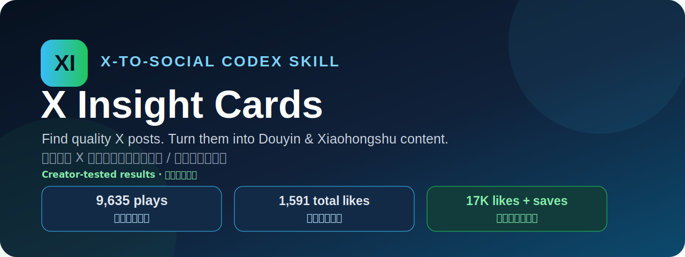
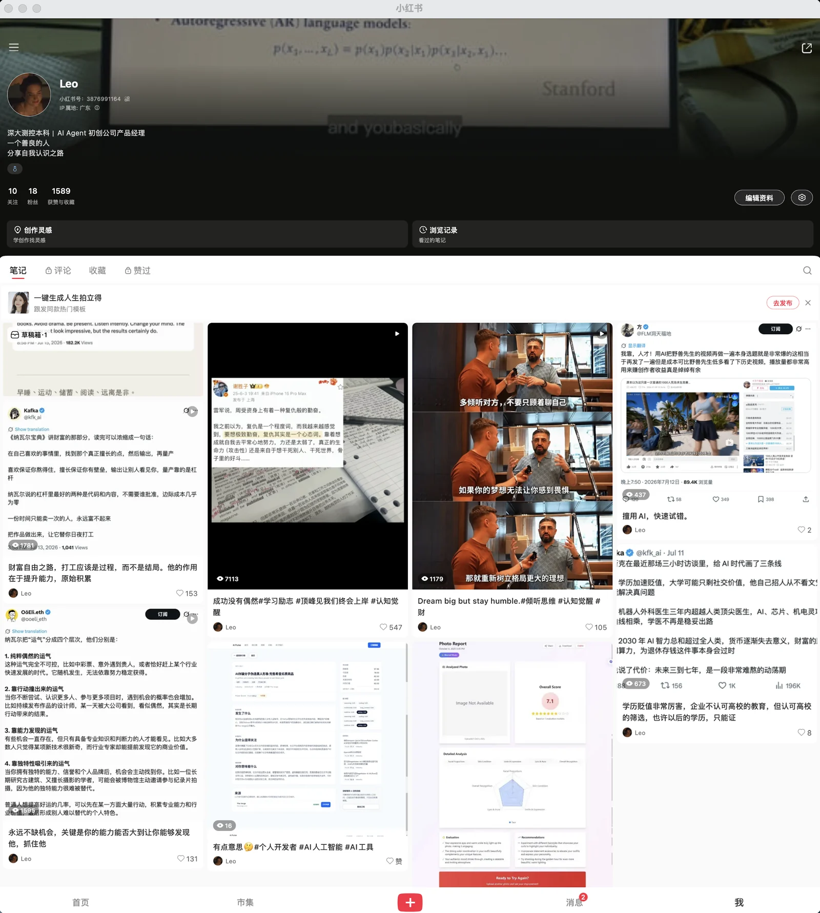
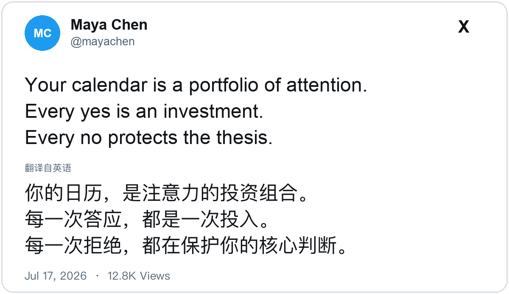

<p align="center">
  
</p>

<p align="center">
  <strong>自动搜集 X 优质帖子，并转化为抖音、小红书图文素材的 Codex Skill。</strong><br />
  <strong>A Codex Skill that finds high-quality X posts and turns them into content for Douyin and Xiaohongshu.</strong>
</p>

<p align="center">
  <a href="README.md">English</a> ·
  <a href="#快速开始">快速开始</a> ·
  <a href="#creator-tested">实测数据</a> ·
  <a href="#工作流程">工作流程</a>
</p>

<p align="center">
  
  
  
  
</p>

<a id="快速开始"></a>

## 安装一次，一句话开始 · One command, one prompt

**这是一个可安装的 Codex Skill，不是需要自己拼装脚本的模板。** 复制这一条命令：

```bash
npx skills add https://github.com/ljunnan24-hash/x-insight-cards --skill x-insight-cards --agent codex --global --copy --yes
```

新建一个 Codex 任务，然后说：

```text
使用 $x-insight-cards 寻找今天最好的 X 原帖，生成最多 5 组
可直接审核的抖音、小红书图片与极简中文配文。
```

**就这些。** 安装一次，以后在任何 Codex 任务里调用 `$x-insight-cards` 即可。无需 API Key、无需导出 Cookie、无需自己拼提示词，也无需登录发布平台；Skill 会从选题一直完成到视觉质检，并停在人工审核前。

## 它能做什么

**X Insight Cards 自动完成发布前的素材准备：寻找优质 X 原帖、核验来源、评分去重、按需翻译排版，最终生成适合抖音和小红书的图片与极简配文。**

**X Insight Cards automates the work before publishing: it finds strong X posts, verifies and ranks them, removes duplicates, translates when needed, and produces source-attributed images plus concise Chinese captions for Douyin and Xiaohongshu.**

`发现 → 核验 → 排序 → 去重 → 翻译 → 排版 → 人工审核`

每次运行会得到：

- 自动发现并排序近期值得做成内容的优质 X 原帖。
- 最多 5 组抖音、小红书素材；不足 5 条绝不凑数。
- 每组包含 1 张保留作者与来源的 PNG，以及 1 条可直接复制的极简中文配文。
- 1 份不进入公开交付目录的历史记录，用于去重和审计。

<a id="creator-tested"></a>

## 抖音、小红书真实账号实测

这套工作流已经用于真实创作者账号。用户提供的原始截图显示：

| 平台 | 实测数据 |
| --- | --- |
| **抖音账号** | **12 条作品**，累计 **1,591 获赞** |
| **抖音可见作品** | **1.1 万、9,635、1,148、1,063、703、676 播放** |
| **小红书账号** | 累计 **1,589 获赞与收藏** |
| **小红书可见作品** | **7,113 浏览 / 547 赞、1,595 / 131、1,179 / 105、1,041 / 153** |

公开账号：抖音号 `51536643904` · 小红书号 `3876991164`。

### 抖音账号与作品表现 · Douyin creator results

<a href="assets/proof/douyin-creator-results.png"></a>

抖音号：`51536643904` · README 加载轻量 WebP 预览；点击图片查看原始 PNG。

### 小红书账号与作品表现 · Xiaohongshu creator results

<a href="assets/proof/xiaohongshu-creator-results.png"></a>

小红书号：`3876991164` · README 加载轻量 WebP 预览；点击图片查看原始 PNG。

**English summary:** The Douyin profile shows **12 posts and 1,591 total likes**, with visible posts reaching up to **11K plays**. The Xiaohongshu profile shows **1,589 total likes and saves**, including a visible post with **7,113 views and 547 likes**.

这两张截图已获创作者授权公开，用于证明工作流产出的素材经过真实账号使用，但不代表未来作品一定获得相同流量。点击图片可查看原始分辨率；选题、账号基础、发布时间和平台分发仍然会影响结果。

## 为什么值得用

| 常见问题 | X Insight Cards 的处理方式 |
| --- | --- |
| 每天寻找优质内容素材很耗时 | 自动发现近期 X 原帖，并按认知增量和中文创作适配度评分 |
| 截图传播丢失作者与上下文 | 保留作者、账号、原帖链接、日期与英文原文 |
| 直译中文生硬，混排字体不协调 | 忠实保留语义和语气，并按简体中文原生规则排版 |
| 日更容易重复旧内容和旧选题 | 按规范化 URL 与正文哈希双重去重 |
| 自动化容易越过账号安全边界 | 只使用公开只读来源，默认停在人工审核 |

## 工作流程

1. 搜索最近 24 小时内容；不足时扩展到 72 小时，再不足时使用未采用过的常青内容。
2. 核验 URL、作者、账号、英文原文、日期和必要浏览量。
3. 排除政治争议、荐股、医疗建议、卖课、搬运和纯情绪鸡汤。
4. 对候选内容进行 100 分评分，低于 75 分直接淘汰。
5. 对照历史记录，排除重复 URL、重复正文和重复选题。
6. 忠实翻译，并让中文排版单向匹配英文原帖的视觉格式。
7. 渲染卡片、生成一至两句配文、完成质检，停在人工审核。

如果只有 3 条达到 75 分，就只交付 3 条。质量优先于数量。

## 评分标准

| 维度 | 分值 |
| --- | ---: |
| 认知增量 | 30 |
| 一句话表达清晰度 | 20 |
| 中文社媒适配度 | 20 |
| 作者与来源可信度 | 15 |
| 新鲜度 | 10 |
| 画面可读性 | 5 |

## 中文排版不是附加项

英文原帖是固定视觉基准。中文只单向匹配英文的视觉字号、笔画粗细、行距和颜色，不反向修改英文格式。

- 大陆简体中文横排标点使用字体原生的全角度量。
- 逗号、句号、分号、冒号、问号和叹号保持原生低位。
- 破折号与省略号居中；引号、括号、书名号保持成对字形。
- macOS 默认优先使用 **PingFang SC Regular** 作为中文正文字体。

可通过 `XIC_LATIN_FONT`、`XIC_CJK_FONT` 及对应字体索引变量覆盖默认字体。

## 不安装 Skill，只使用渲染器

```bash
python3 -m venv .venv
source .venv/bin/activate
pip install -r requirements.txt

python skills/x-insight-cards/scripts/render_card.py \
  --input examples/demo-post.json \
  --output examples/demo-card.png
```



演示作者和内容均为虚构，不包含第三方头像或真实原帖。

## 默认权限边界

- 不读取、导出或保存 Cookie、密码、Token 和会话数据。
- 不绕过登录墙、验证码、风控、速率限制或平台权限。
- 不自动打开发布页、创建草稿、上传或发布。
- `assets/proof/` 中两张创作者授权的结果截图仅用于项目说明；仓库不包含账号凭据、私密账号数据或系统字体。
- 重排卡片必须标记为“重排渲染”，不得冒充原生截图。

发布永远是独立、明确、由用户决定的下一步。

## 贡献

欢迎提交 Issue 和 PR，尤其是 Windows/Linux 中文字体、中文换行、可访问性和评分证据方面的改进。详见 [CONTRIBUTING.md](CONTRIBUTING.md)。

如果它帮你省掉了重复搭建创作者工作流的时间，欢迎点一个 Star，让更多创作者找到它。

## 许可证

代码与原创文档采用 MIT License。详见 [LICENSE](LICENSE) 与 [NOTICE.md](NOTICE.md)。
